# Práctica 01: Vistas Materializadas
## Adrian Aguilera Moreno - 421005200

### Instalación de VirtualBox

Instalamos desde Fedora:

| 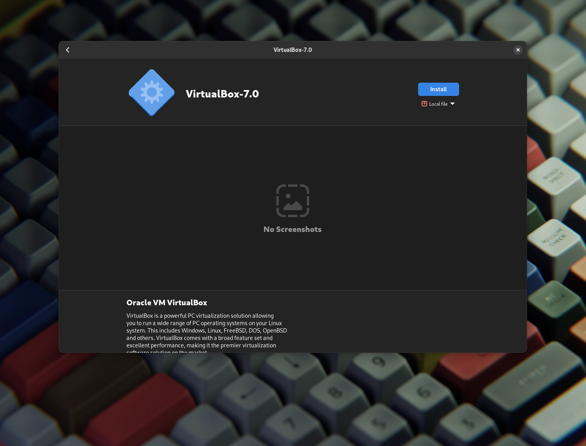

| 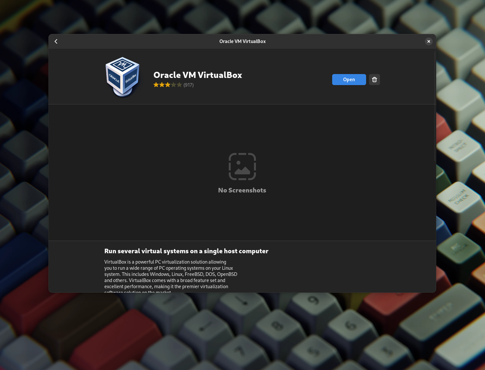

| 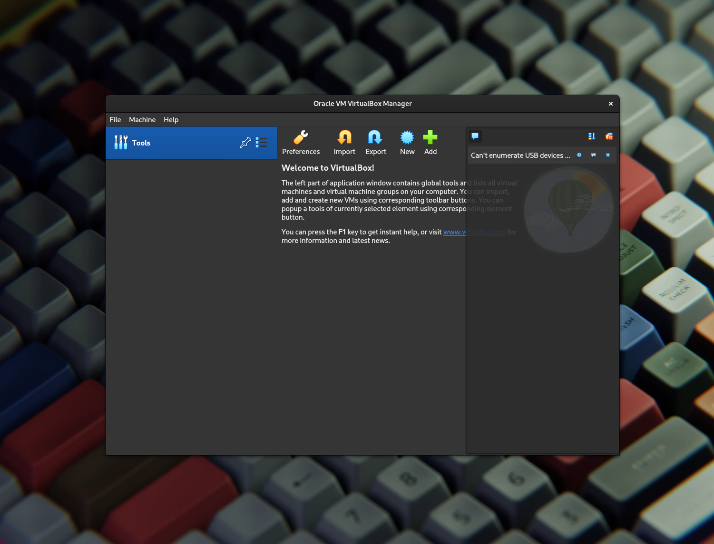

| 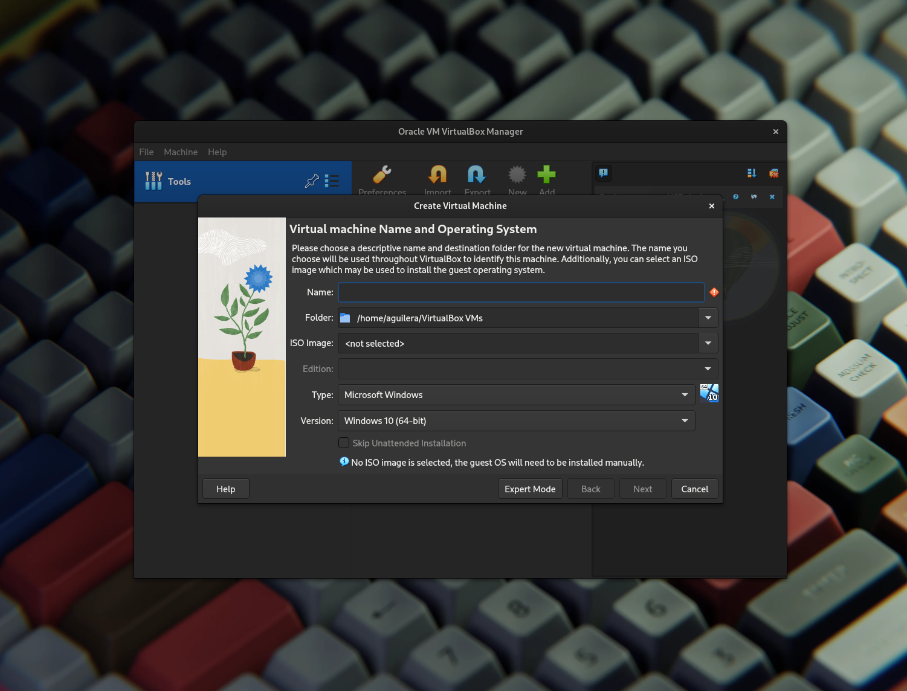

| 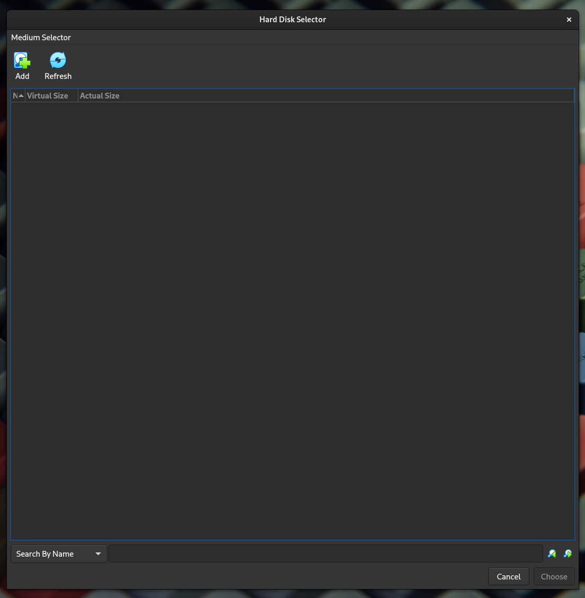

| 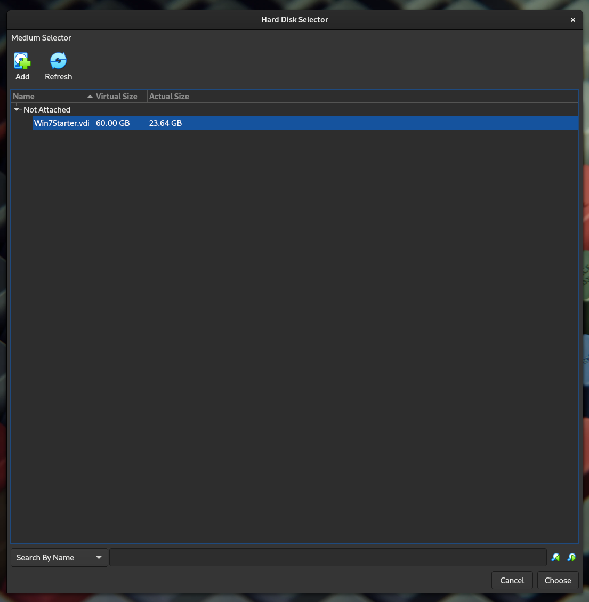

| 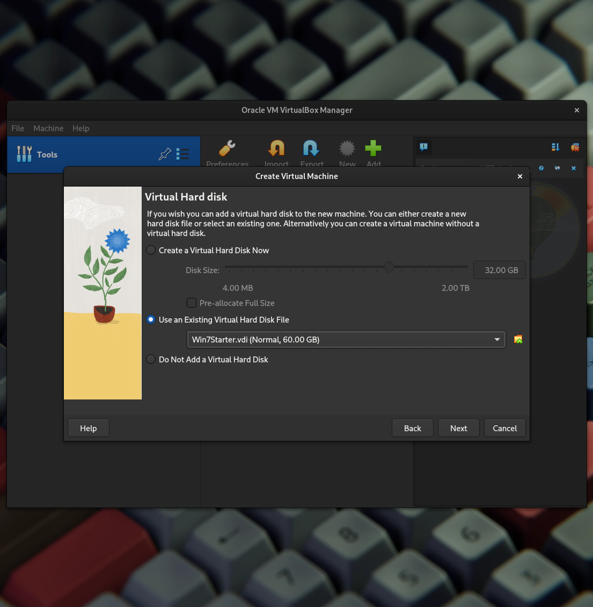

| 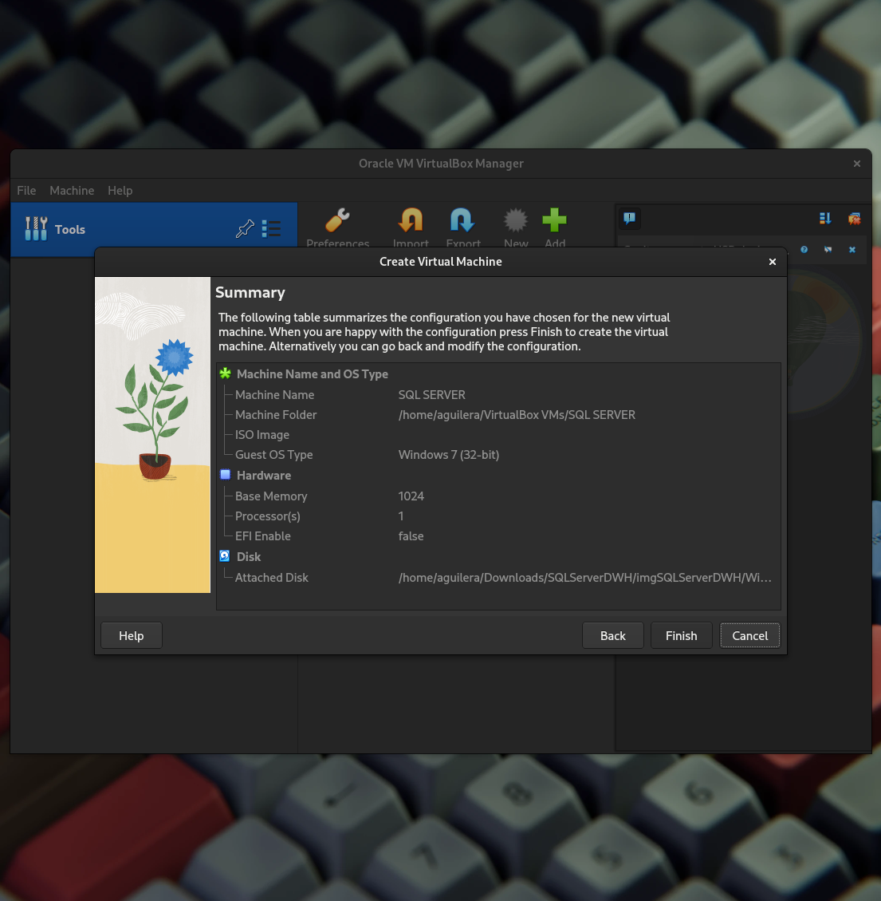

| 

| 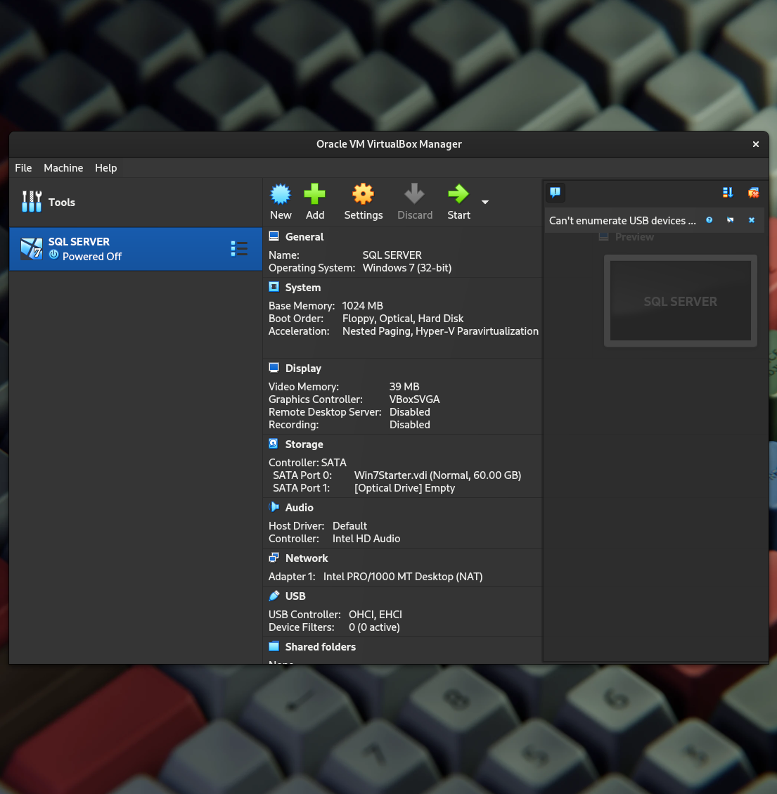

### Creación de directorio compartido

|
|:----------------------:|

|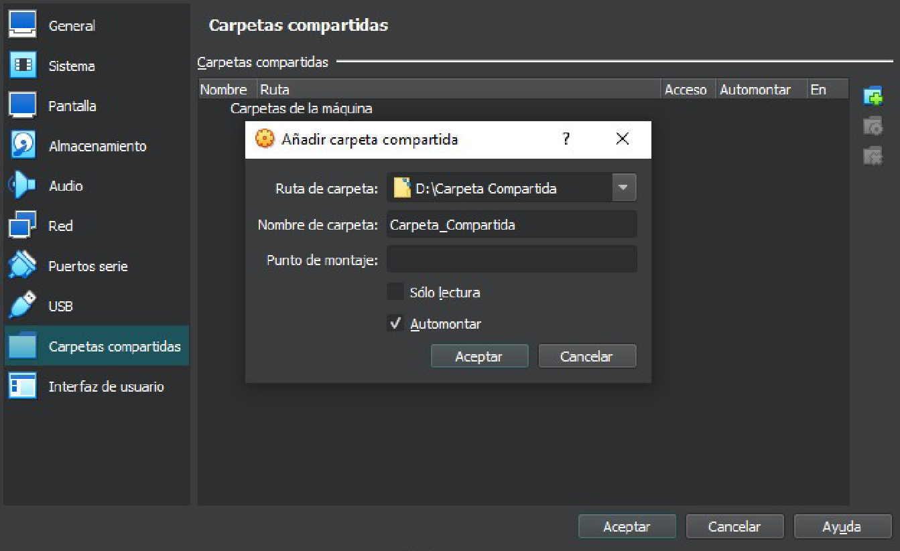
|:----------------------:|

|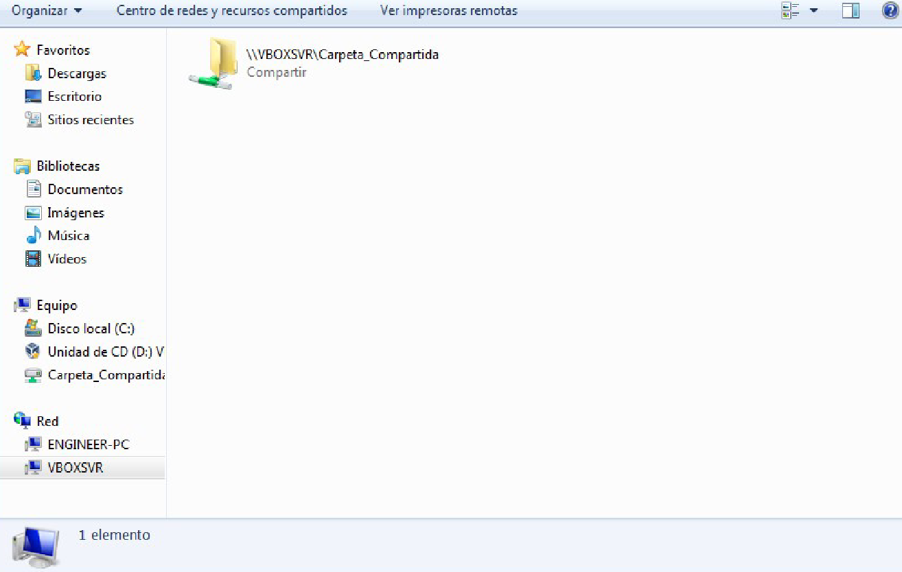
|:----------------------:|
