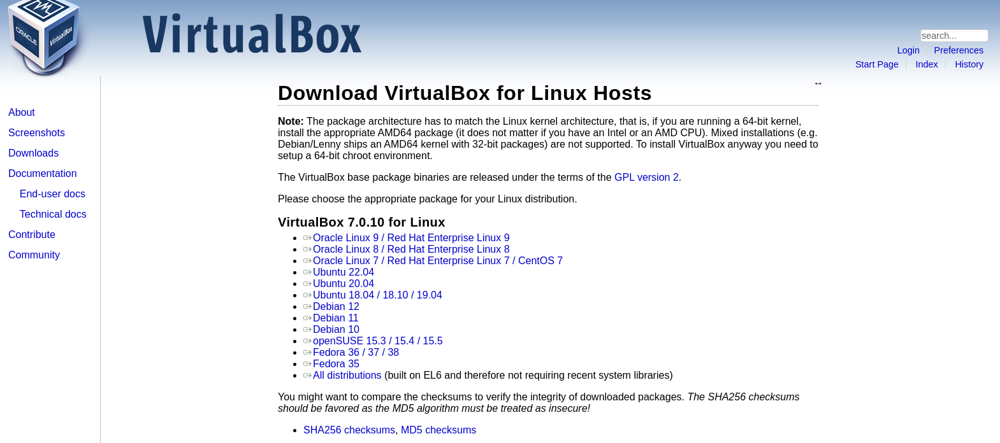
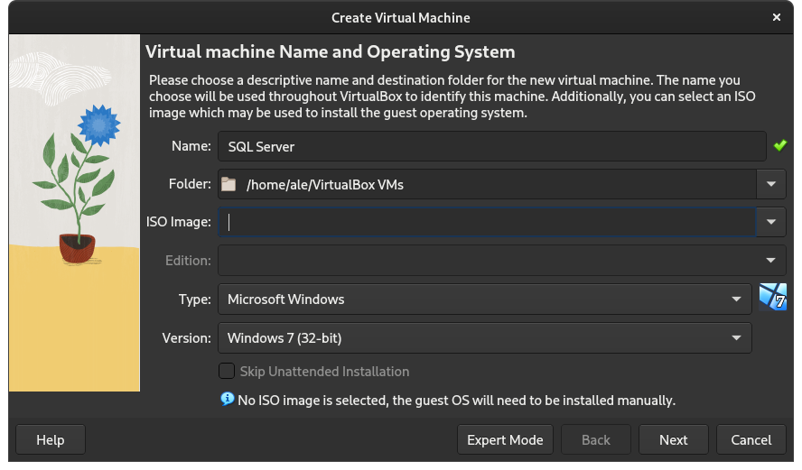
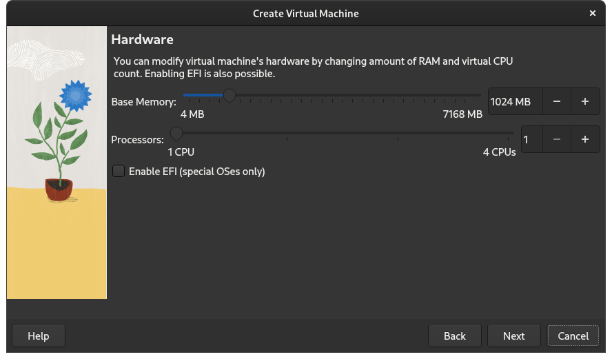
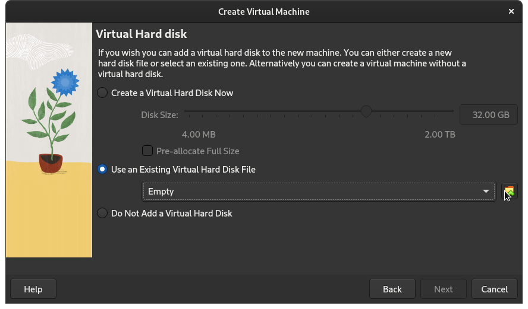
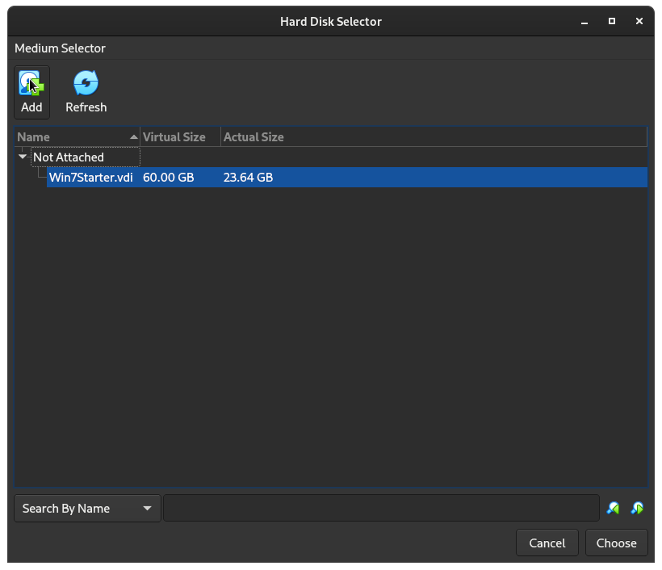
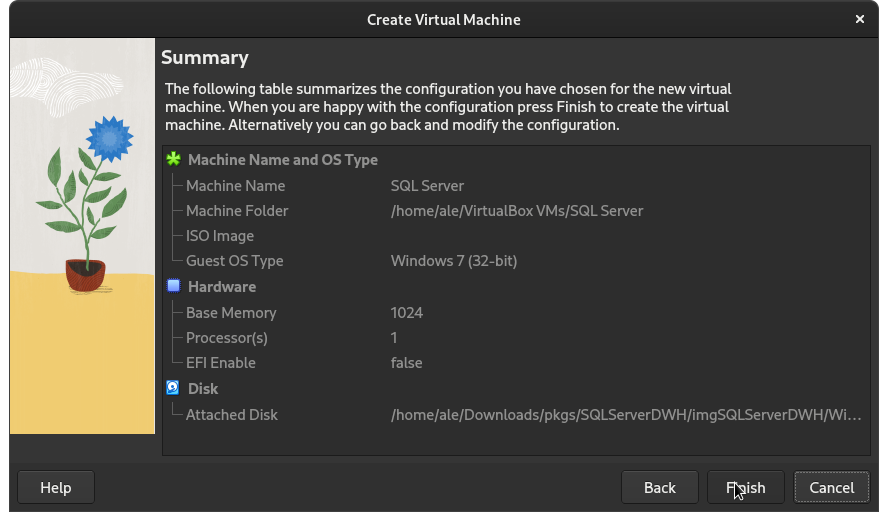
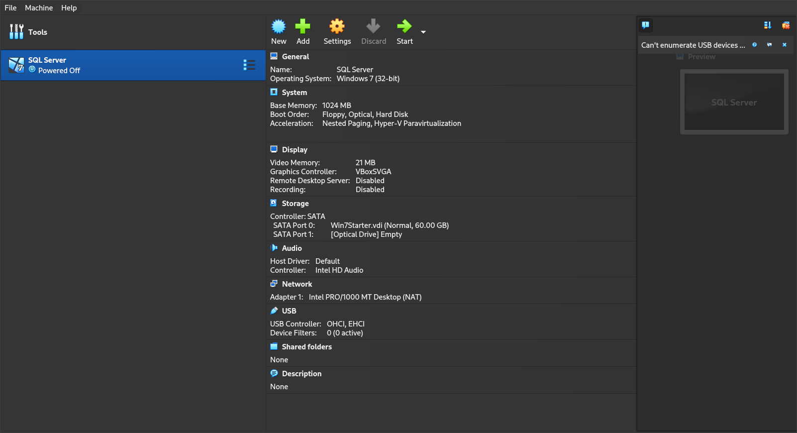
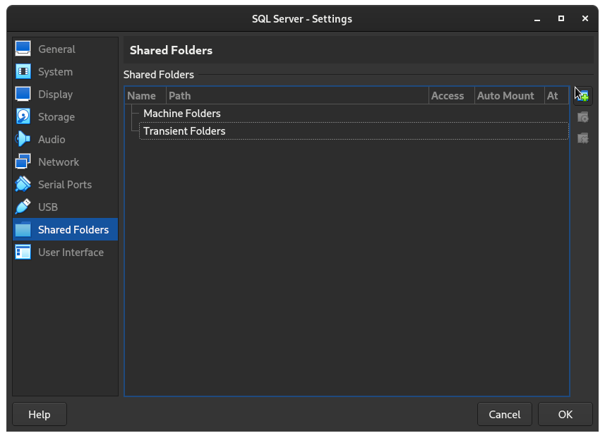
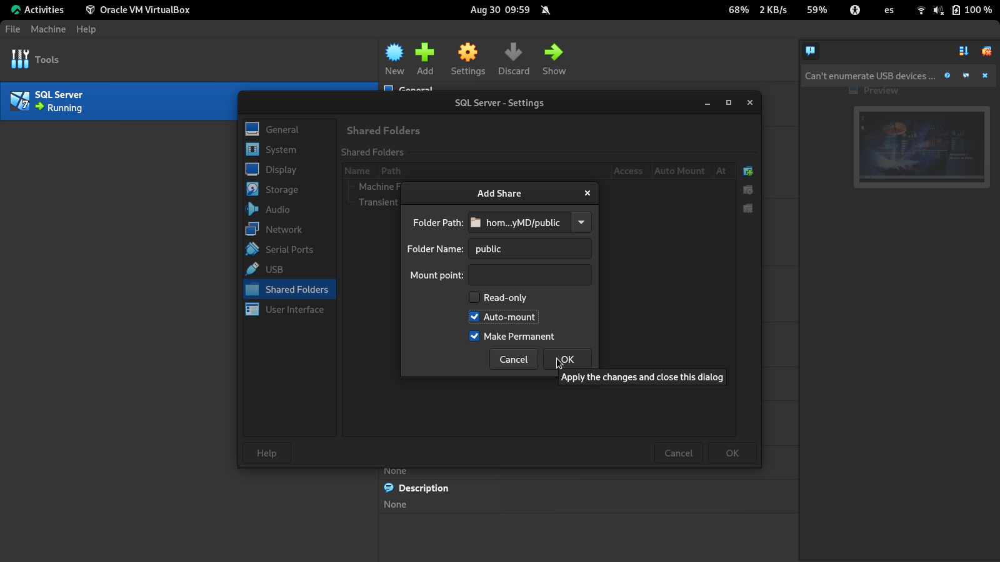
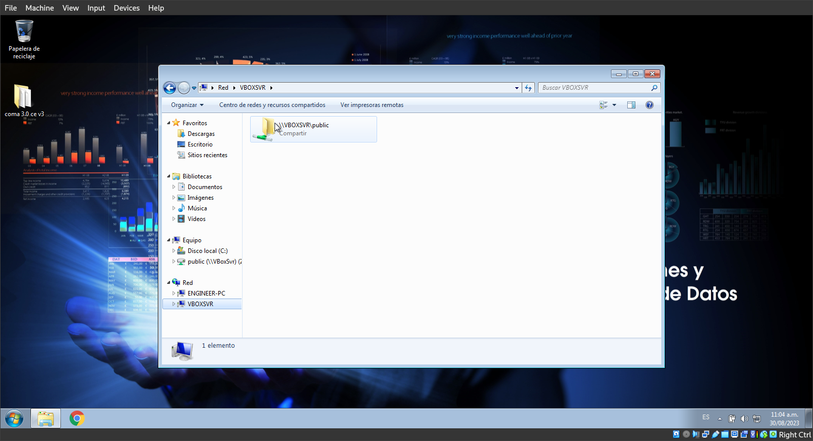

# Práctica 01: Vistas Materializadas
## Alejandra Ortega García - 420002495

### Instalación de VirtualBox

De acuerdo con la distribución que se tenga se selecciona y descarga el paquete de `VirtualBox`.

| 
|:----------------------:|
[https://www.virtualbox.org/wiki/Linux_Downloads](https://www.virtualbox.org/wiki/Linux_Downloads) 

Dirigirse al directorio donde se encuentra el paquete, y ejecutar el comando:

```
λ ~/Downloads/pkgs/ sudo dnf install VirtualBox-7.0-7.0.10_158379_el9-1.x86_64.rpm
```

Faltaron algunos modulos ... 

```
This system is currently not set up to build kernel modules.
Please install the Linux kernel "header" files matching the current kernel
for adding new hardware support to the system.
The distribution packages containing the headers are probably:
    kernel-devel kernel-devel-5.14.0-284.25.1.el9_2.x86_64
This system is currently not set up to build kernel modules.
Please install the Linux kernel "header" files matching the current kernel
for adding new hardware support to the system.
The distribution packages containing the headers are probably:
    kernel-devel kernel-devel-5.14.0-284.25.1.el9_2.x86_64

There were problems setting up VirtualBox.  To re-start the set-up process, run
  /sbin/vboxconfig
as root.  If your system is using EFI Secure Boot you may need to sign the
kernel modules (vboxdrv, vboxnetflt, vboxnetadp, vboxpci) before you can load
them. Please see your Linux system's documentation for more information.

  Verifying        : qt5-qttools-libs-help-5.15.3-4.el9.x86_64                                1/3 
  Verifying        : qt5-qttools-common-5.15.3-4.el9.noarch                                   2/3 
  Verifying        : VirtualBox-7.0-7.0.10_158379_el9-1.x86_64  
```

Para agregarlos, ejecutar en la terminal:

```
λ ~/ sudo dnf install kernel-devel kernel-devel-$(uname -r) kernel-headers kernel-headers-$(uname -r) make patch gcc
```
Despues, reiniciamos `VirtualBox`,

```
λ ~/ sudo su
λ ~/ /sbin/vboxconfig
```
Verificamos el servicio `vboxdrv`,
```
λ ~/ systemctl status vboxdrv 
● vboxdrv.service - VirtualBox Linux kernel module
     Loaded: loaded (/usr/lib/virtualbox/vboxdrv.sh; enabled; preset: disabled)
     Active: active (exited) since Tue 2023-08-29 18:04:53 CST; 55min ago
    Process: 26921 ExecStart=/usr/lib/virtualbox/vboxdrv.sh start (code=exited, status=0/SUCCESS)
        CPU: 282ms

Aug 29 18:04:53 rockobaxter systemd[1]: Starting VirtualBox Linux kernel module...
Aug 29 18:04:53 rockobaxter vboxdrv.sh[26921]: vboxdrv.sh: Starting VirtualBox services.
Aug 29 18:04:53 rockobaxter systemd[1]: Started VirtualBox Linux kernel module.
```
Abrimos `VirtualBox`,

|
|:----------------------:|
`VirtualBox 7.0`

### SQL Server

Se descarga y descomprime `SQL Server`.

[https://www.mediafire.com/file/svwjnm1xkjn4z57/SQLServerDWH.zip/file?authuser=0](https://www.mediafire.com/file/svwjnm1xkjn4z57/SQLServerDWH.zip/file?authuser=0)

En `VirtualBox`, seleccionar la opcion `New` para crear una maquina virtual con las siguientes especificaciones.

|
|:----------------------:|

|
|:----------------------:|

En esta parte, seleccionar la opcion *Use an Existing Virtual Hard Disk File* para depues agregar el archivo que se extrajo. 

|
|:----------------------:|
Para agregar el achivo seleccionar la opcion que se muestra.

|
|:----------------------:|
Seleccionar la opcion *choose* y despues la opcion *Next* para continuar con la configuracion.

|
|:----------------------:|
Finalizar con la creacion de la maquina virtual.

|
|:----------------------:|
Maquina Virtual. 

Iniciar la maquina virtual con seleccionando la opcion *start* que se muestro en la imagen anterior. 

|
|:----------------------:|
`Windows 7`

Para agregar un directorio compartido, primero lo creamos en la maquina fisica. Despues, seleccionamos la opcion *settings* de nuestra maquina virtual y nos dirigimos al apartado *Shared Folders*. 

|
|:----------------------:|


Seleccionar la opcion *Machine Folders*.
|
|:----------------------:|

Ingresar la ruta del directorio que se creo al inicio, agregar el nombre y seleccionar la opciones que se muestran en la imagen.

|
|:----------------------:|

Verificamos en la maquina virtual la creacion del directorio compartido, en el apartado de *Red > VBOXSVR*.

|
|:----------------------:|
Directorio compartido.